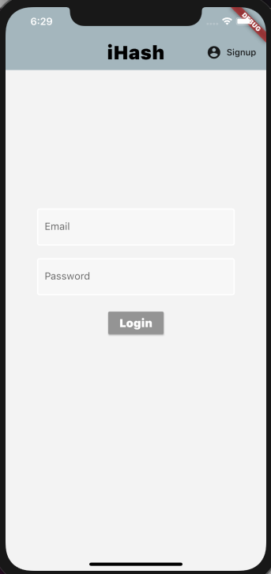

# iHash

iHash is a mobile application that allows users to generate hashtags by uploading their own images.

## Tech Stack

### Flutter

https://flutter.dev/

- Flutter is Google's UI toolkit for building natively compiled applications for mobile, web, and desktop from a single codebase.

### Dart

https://dart.dev/

- Dart is a programming language specialized around the needs of user interface creation.

### Firebase

https://firebase.google.com/

- Firebase is a comprehensive app development platform that allows developers to build apps fast without managing infrastructure.

- Firebase offers functionalities such as analytics, databases, messaging and crash reporting.

### TensorFlow Lite

https://www.tensorflow.org/lite

- TensorFlow Lite is an open source deep learning framework for on-device inference and enables deployment of machine learning models on mobile and IoT devices.

## Gallery

 
 
 
